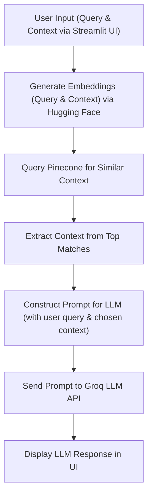

# 🧠 RAG Chatbot

A modular Retrieval-Augmented Generation (RAG) chatbot built with **Streamlit**, **Pinecone**, **Sentence Transformers**, and **Groq LLM**. This chatbot retrieves relevant document snippets from your custom data and uses LLMs to generate accurate, context-aware answers.

---

## 📁 Project Structure

```
rag-chatbot/
│
├── app.py                # Main Streamlit app
├── ingest.py             # Script to upload data to Pinecone
├── requirements.txt      # Python dependencies
│
├── utils/
│   ├── embedder.py       # Embedding generation using Sentence Transformers
│   ├── llm_utils.py      # LLM querying (Groq)
│   └── pinecone_utils.py # Pinecone DB utilities
│
└── .streamlit/
    ├── secrets.toml      # API keys (never commit this)
    └── config.toml       # Optional Streamlit configuration
```

---

## ⚙️ How It Works

### 🔹 Data Ingestion (`ingest.py`)

* Reads your source data.
* Generates embeddings using `all-MiniLM-L6-v2`.
* Upserts the embeddings and metadata to **Pinecone**.

### 🔹 Chat Application (`app.py`)

* Accepts user queries via Streamlit UI.
* Generates embeddings for queries.
* Searches Pinecone for top-matching document chunks.
* Constructs a prompt with the query and retrieved context.
* Sends it to **Groq's `llama3-8b-instant`** for response generation.
* Displays the output to the user.

---

## 🔧 Setup Instructions

### 1. Clone the Repository

```bash
git clone https://github.com/pruthvirajshitole/ChatBot-using-RAG
cd rag-chatbot
```

### 2. Install Dependencies

```bash
pip install -r requirements.txt
```

### 3. Configure API Keys

Create a file at `.streamlit/secrets.toml` and add:

```toml
[general]
PINECONE_API_KEY = "your-pinecone-api-key"
GROQ_API_KEY = "your-groq-api-key"
```

> ⚠️ **Never commit your `secrets.toml` to version control.**

### 4. Ingest Your Data

```bash
python ingest.py
```

### 5. Launch the Chatbot

```bash
streamlit run app.py
```

Visit the local Streamlit URL to start chatting.

---

## 🧱 Tech Stack

* 🧠 **LLM**: Groq API (`llama3-8b-instant`)
* 📆 **Vector DB**: Pinecone
* 🔍 **Embedding Model**: `sentence-transformers/all-MiniLM-L6-v2`
* 🖼️ **Frontend**: Streamlit
* 🛠️ **Language**: Python

---

## 📊 RAG Pipeline Overview



---

## 🚀 Deployment

* For **local use**, Streamlit is sufficient.
* For 🚀 **Cloud Deployment**, you can host on platforms like:
- [Streamlit Community Cloud](https://streamlit.io/cloud)
- [Render](https://render.com)
- [Railway](https://railway.app)

👉 **Live App:** [Click here to try the RAG Chatbot](https://chatbot-using-rag-techonsy.streamlit.app/)

---

## 📌 Notes

* Modular design allows swapping out vector DBs or LLMs.
* `.env` is no longer used; all secrets go in `.streamlit/secrets.toml`.
* Easily extendable for PDFs, websites, or Notion content ingestion.

---

## 💡 Future Improvements

* Support for PDF/Text/CSV ingestion
* OpenAI or Gemini as optional LLM backends
* Document preview panel
* Chat history saving

---

## 📝 License

MIT License. See `LICENSE` file for details.
